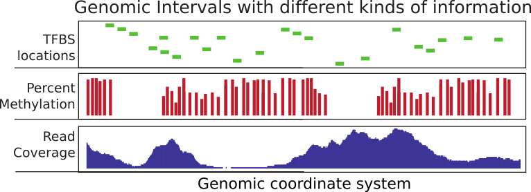

```{r,setup,echo=FALSE}
library(knitr)
opts_chunk$set(echo = TRUE, cache=FALSE,warning=FALSE,message=FALSE)
read_chunk('genomicIntervals_chunks.R')
library(captioner)
fig_nums <- captioner()

```

A considerable time in computational genomics is spent on overlapping different 
features of the genome. Each feature can be represented with a genomic interval 
within the chromosomal coordinate system. In addition, each interval can carry 
different sorts of information. You can have exon coordinates or transcription 
factor binding sites just represents an interval. On the other hand,
you can have basebair resolution, continuous scores over the genome such as read coverage or 
scores could be associated with only certain bases such as in the case of CpG 
methylation (See `r fig_nums("gintsum",display="cite")`). Typically, you will need to overlap intervals on interest with other features of 
the genome again represented as intervals. For example, you may want to overlap 
transcription factor binding sites with CpG islands or promoters to quantify what percentage of binding sites overlap with your regions of interest. For e To achieve those goals, you will need to overlap genomic intervals. Overlapping mapped reads from high-throughput sequencing experiments with genomic features such as exons, promoters, enhancers can also be classified as operations on genomic intervals. You can think of a million other ways that involves overlapping two sets of different features on the genome. This chapter aims to show how to do analysis involving operations on genomic intervals.
  
 
 `r fig_nums("gintsum","Summary of genomic intervals with different kinds of information") ` 

# Operations on Genomic Intervals with GenomicRanges package
[Bioconductor](http://bioconductor.org) project has a dedicated package called [**GenomicRanges**](http://www.bioconductor.org/packages/release/bioc/html/GenomicRanges.html) to deal with genomic intervals. In this section, we will provide use cases involving operations on genomic intervals. The main reason we will stick to this package is that it provides tools to do overlap operations. However package requires that users operate on specific data types that are conceptually similar to a tabular data structure implemented in a way that makes overlapping and related operations easier. The main object we will be using is called GRanges object and we will also see some other related objects from the GenomicRanges package.


## How to create and manipulate a GRanges object

GRanges (from GenomicRanges package) is the main object that holds the genomic intervals and extra information about those intervals. Here we will show how to create one. Conceptually, it is similar to a data frame and some operations such as using **[ ]** notation to subset the table will work also on GRanges, but keep in mind that not everything that works for data frames will work on GRanges objects.

```{r,createGR}

```
As you can see it looks a bit like a data frame. Also, note that the peculiar second argument “ranges” which basically contains start and end positions of the genomic intervals. However, you can not just give start and end positions you actually have to provide another object of IRanges. Do not let this confuse you, GRanges actually depends on another object that is very similar to itself called IRanges and you have to provide the “ranges” argument as an IRanges object. In its simplest for, an IRanges object can be constructed by providing start and end positions to IRanges() function. Think of it as something you just have to provide in order to construct the GRanges object.

GRanges can also contain other information about the genomic interval such as scores, names, etc. You can provide extra information at the time of the construction or you can add it later. Here is how you can do those:

```{r,createGRwMetadata}

```

## Getting genomic regions into R as GRanges objects

There are multiple ways you can read in your genomic features into R and create a GRanges object. Most genomic interval data comes as a tabular format that has the basic information about the location of the interval and some other information. We already showed how to read BED files as data frame. Now we will show how to convert it to GRanges object. This is one way of doing it, but there are more convenient ways described further in the text.

```{r,convertDataframe2gr}

```
You may need to do some pre-processing before/after reading in the BED file. Below is an example of getting transcription start sites from BED files containing refseq transcript locations.

```{r,convertDataframe2grTSS}

```

Reading the genomic features as text files and converting to GRanges is not the only way to create GRanges object. With the help of [rtracklayer](http://www.bioconductor.org/packages/release/bioc/html/rtracklayer.html) package we can directly import BED files.

```{r,importbed_rtracklayer,eval=FALSE}

```

Now we will show how to use other packages to automatically obtain the data in GRanges format. But you will not be able to use these methods for every data set so it is good to now how to read data from flat files as well. First, we will use rtracklayer package to download data from [UCSC browser](http://genome-euro.ucsc.edu/cgi-bin/hgGateway?hgsid=197855328_moRAG0Dqe1qlcOEtNDAt09E1e6ab). We will download CpG islands as GRanges objects.

```{r,importFromUCSC,eval=FALSE}

```


## Finding regions that do/do no overlap with another set of regions

This is one of the most common tasks in genomics. Usually, you have a set of regions that you are interested in and you want to see if they overlap with another set of regions or see how many of them overlap. A good example is transcription factor binding sites determined by [ChIP-seq](http://en.wikipedia.org/wiki/ChIP-sequencing) experiments. In these types of experiments and followed analysis, one usually ends up with genomic regions that are bound by transcription factors. One of the standard next questions would be to annotate binding sites with genomic annotations such as promoter,exon,intron and/or CpG islands. Below is a demonstration of how transcription factor binding sites can be annotated using CpG islands. First, we will get the subset of binding sites that overlap with the CpG islands. In this case, binding sites are ChIP-seq peaks.

We can find the subset of peaks that overlap with the CpG islands using **subsetByoverlaps()** function. You will also see another way of converting **data frames** to **GRanges**.

```{r,findPeakwithCpGi}

```
For each CpG island, we can count the number of peaks that overlap with a given CpG island with countOverlaps().

```{r,countOverlaps}

```

findOverlaps() function can be used to see one-to-one overlaps between peaks and CpG islands. It returns a matrix showing which peak overlaps with which CpGi island.

```{r,findOverlaps}

```

Another interesting thing would be to look at the distances to nearest CpG islands for each peak. In addition, just finding the nearest CpG island could also be interesting. Often times, you will need to find nearest TSS or gene to your regions of interest, and the code below is handy for doing that.

```{r,findNearest}

```


# Dealing with high-throughput sequencing reads
In recent years, advances in sequencing technology helped researchers sequence the genome deeper than ever. The reads from sequencing machines are usually aligned to the genome and the next task is to quantify the enrichment of those aligned reads in the regions of interest. You may want to count how many reads overlapping with your promoter set of interest or you may want to quantify RNA-seq reads overlapping with exons. This is similar to operations on genomic intervals which are described previously. If you can read all your alignments into the memory and create a GRanges object, you can apply the previously described operations. However, most of the time we can not read all mapped reads into the memory, so we have to use specialized tools to query and quantify alignments on a given set of regions. One of the most common alignment formats is SAM/BAM format, most aligners will produce SAM/BAM output or you will be able to convert your specific alignment format to SAM/BAM format. BAM format is binary version of the human readable SAM format. SAM format have specific columns that contain different kind of information about the alignment such as mismatches, qualities etc. (see http://samtools.sourceforge.net/SAM1.pdf for SAM format specification).

## Quality check on sequencing reads and mapping reads to the genome

The sequencing technologies usually produce basecalls with varying quality. In addition, there could be sample-prep specific issues in your sequencing run, such as adapter contamination. It is standard procedure to check the quality of the reads before further analysis. Checking the quality and making some decisions for the downstream analysis can influence the outcome of your analysis. For a long time, quality check and mapping tasks were outside the R domain. However, certain packages in Bioconductor currently can deal with those tasks. Although, we will not go into detail we will mention some packages that can help with quality check and mapping.

Read quality checking is possible with Bioconductor packages: [qcrc](http://www.bioconductor.org/packages/release/bioc/html/qrqc.html), [Rsubread](http://www.bioconductor.org/packages/release/bioc/html/Rsubread.html) and [QuasR](http://www.bioconductor.org/packages/release/bioc/html/QuasR.html). All the packages seem to have interface to C for fast quality score calculations or I/O operations. For the read mapping, QuasR uses Rbowtie package and produces BAM files (see below for short intro on BAM) and Rsubread employs its own mapping algorithm and can also produce BAM files.


## Counting mapped reads for a set of regions

Rsamtools package has functions to query BAM files. The function we will use in the first example is countBam which takes input of the BAM file and param argument. “param” argument takes a ScanBamParam object. The object is returned by ScanBamParam() function and contains parameters for scanning the BAM file. The example below is a simple example and ScanBamParam() only includes regions of interest, promoters on chr21.

```{r,countBam}

```

Alternatively, aligned reads can be read in using GenomicAlignments package (which on this occasion relies on RSamtools package).

```{r,readGAlignments}

```


# Dealing with contiguous scores over the genome
Most high-throughput data can be viewed as a continuous score over the bases of the genome. In case of RNA-seq or ChIP-seq experiments the data can be represented as read coverage values per genomic base position. In addition, other information (not necessarily from high-throughput experiments) can be represented this way. The GC content and conservation scores per base are prime examples of other data sets that can be represented as scores. This sort of data can be stored as a generic text file or can have special formats such as Wig (stands for wiggle) from UCSC, or the bigWig format is which is indexed binary format of the wig files. The bigWig format is great for data that covers large fraction of the genome with varying scores, because the file is much smaller than regular text files that have the same information and it can be queried easier since it is indexed.

In R/Bioconductor, the continuous data can also be represented in a compressed format, in a format called Rle vector, which stands for run-length encoded vector. This gives superior memory performance over regular vectors because repeating consecutive values are represented as one value in the Rle vector (See `r fig_nums("Rle",display="cite")`).  `r fig_nums("Rle","Rle encoding explained") ` 

Typically, for genome-wide data you will have a RleList object which is a list of Rle vectors per chromosome. You can obtain such vectors by reading the reads in and calling *coverage()* function from *GenomicRanges* package. Let's try that on the above data set.

```{r,getCoverageFromAln}

```

Alternatively, you can get the coverage from the Bam file directly. Below, we are getting the coverage directly from the Bam file for our previously defined promoters.
```{r,getCoverageFromBam}

```

One of the most common ways of storing score data is, as mentioned, wig or bigWig format. Most of the ENCODE project data can be downloaded in bigWig format. In addition, conservation scores can also be downloaded as wig/bigWig format. You can import bigWig files into R using *import()* function from *rtracklayer* package. However, it is generally not advisable to read the whole bigWig file in memory as it was the case with BAM files. Usually, you will be interested in only a fraction of the genome, such as promoters, exons etc. So it is best you extract the data for those regions and read those into memory rather than the whole file. Below we read the a bigWig file only for promoters. The operation returns an *GRanges* object with score column which indicates the scores in the BigWig file per genomic region.
```{r,getRleFromBigWig}

```

## Summarizing scores over the genome


# Session info
```{r}
sessionInfo()
```
