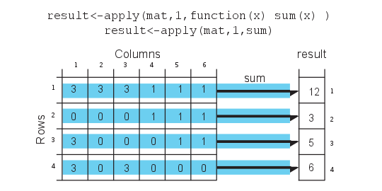

R is a free statistical programming language that is popular among researchers and data miners to build software and analyze data1. In next sections, we will first get you started with the setup of environment for using R and then introduce some basic R operations and data structures that will be good to know if you do not have prior experience with R. If you need more in depth R introduction you will want to check out some beginner level books and online tutorials. This website has a bunch of resources listed: [http: //www.introductoryr.co.uk/R_Resources_for_Beginners.html]()

# The Setup

Download and install R http://cran.r-project.org/ and RStudio http://www.rstudio.com/ if you do not have them already. Rstudio is optional but it is a great tool if you are just starting to learn R.
You will need specific data sets to run the codes in this document. Download the data.zip[URL to come] and extract it to your directory of choice. The folder name should be “data” and your R working directory should be level above the data folder. That means in your R console, when you type “dir(“data”)” you should be able to see the contents of the data folder. You can change your working directory by *setwd()* command and get your current working directory with *getwd()* command in R. In RStudio, you can click on the top menu and change the location of your working directory via user interface.


## Installing packages
R packages are add-ons to base R that help you achieve additional tasks that are not directly supported by base R. It is by the action of these extra functionality that R excels as a tool for computational genomics. Bioconductor project (http://bioconductor.org/) is a dedicated package repository for computational biology related packages. However main package repository of R, called CRAN, has also computational biology related packages. In addition, R-Forge(http://r-forge.r-project.org/), GitHub(https://github. com/), and googlecode(http://code.google.com) are other locations where R packages might be hosted.
You can install CRAN packages using install.packages(). (# is the comment character in R)
```{r,eval=FALSE}
# install package named "randomForests" from CRAN
install.packages("randomForests")
```
You can install bioconductor packages with a specific installer script
```{r,eval=FALSE}
# get the installer package
source("http://bioconductor.org/biocLite.R")
# install bioconductor package "rtracklayer"
biocLite("rtracklayer")
```
You can install packages from github using *install_github()* function from **devtools**
```{r,eval=FALSE}
library(devtools)
install_github("hadley/stringr")
```
Another way to install packages are from the source.
```{r,eval=FALSE}
# download the source file
download.file("http://goo.gl/3pvHYI",
               destfile="methylKit_0.5.7.tar.gz")
# install the package from the source file
install.packages("methylKit_0.5.7.tar.gz",
                 repos=NULL,type="source")
# delete the source file
unlink("methylKit_0.5.7.tar.gz")
```
You  can also update CRAN and Bioconductor packages.
```{r,eval=FALSE}
# updating CRAN packages
update.packages()

# updating bioconductor packages
source("http://bioconductor.org/biocLite.R")
biocLite("BiocUpgrade")
```

## Installing packages in custom locations
If you will be using R on servers or computing clusters rather than your personal computer it is unlikely that you will have administrator access to install packages. In that case, you can install packages in custom locations by telling R where to look for additional packages. This is done by setting up an .Renviron file in your home directory and add the following line:
```
R_LIBS=~/Rlibs
```

This tells R that “Rlibs” directory at your home directory will be the first choice of locations to look for packages and install packages (The directory name and location is up to you above is just an example). You should go and create that directory now. After that, start a fresh R session and start installing packages. From now on, packages will be installed to your local directory where you have read-write access.

## Getting help on functions and packages
You can get help on functions by help() and help.search() functions. You can list the functions in a package with ls() function

```{r,eval=FALSE}
library(MASS)
ls("package:MASS") # functions in the package
ls() # objects in your R enviroment
# get help on hist() function
?hist
help("hist")
# search the word "hist" in help pages
help.search("hist")
??hist

```
### More help needed?
In addition, check package vignettes for help and practical understanding of the functions. All Bionconductor packages have vignettes that walk you through example analysis. Google search will always be helpful as well, there are many blogs and web pages that have posts about R. R-help, Stackoverflow and R-bloggers are usually source of good and reliable information.


# Computations in R
R can be used as an ordinary calculator, some say it is an over-grown calculator. Here are some examples. Remember **#** is the comment character. The comments give details about the operations in case they are not clear.
```r{}
2 + 3 * 5       # Note the order of operations.
log(10)        # Natural logarithm with base e
5^2            # 5 raised to the second power
3/2            # Division
sqrt(16)      # Square root
abs(3-7)      # Absolute value of 3-7
pi             # The number
exp(2)        # exponential function
# This is a comment line


```

# Data structures
R has multiple data structures. If you are familiar with excel you can think of data structures as building blocks of a table and the table itself, and a table is similar to a sheet in excel. Most of the time you will deal with tabular data sets, you will manipulate them, take sub-sections of them. It is essential to know what are the common data structures in R and how they can be used. R deals with named data structures, this means you can give names to data structures and manipulate or operate on them using those names.

## Vectors
Vectors are one the core R data structures. It is basically a list of elements of the same type (numeric,character or logical). Later you will see that every column of a table will be represented as a vector. R handles vectors easily and intuitively. You can create vectors with c() function, however that is not the only way. The operations on vectors will propagate to all the elements of the vectors.

```{r}
x<-c(1,3,2,10,5)    #create a vector named x with 5 components
x = c(1,3,2,10,5)  
x
y<-1:5              #create a vector of consecutive integers y
y+2                 #scalar addition
2*y                 #scalar multiplication
y^2                 #raise each component to the second power
2^y                 #raise 2 to the first through fifth power
y                   #y itself has not been unchanged
y<-y*2
y                   #it is now changed
r1<-rep(1,3)        # create a vector of 1s, length 3
length(r1)           #length of the vector
class(r1)            # class of the vector
a<-1                # this is actually a vector length one
```
## Matrices
A matrix refers to a numeric array of rows and columns. You can think of it as a stacked version of vectors where each row or column is a vector. One of the easiest ways to create a matrix is to combine vectors of equal length using *cbind()*, meaning 'column bind'.

```{r}
x<-c(1,2,3,4)
y<-c(4,5,6,7)
m1<-cbind(x,y);m1
t(m1)                # transpose of m1
dim(m1)              # 2 by 5 matrix
```
You can also directly list the elements and specify the matrix:
```{r}
m2<-matrix(c(1,3,2,5,-1,2,2,3,9),nrow=3)
m2
```
Matrices and the next data structure **data frames** are tabular data structures. You can subset them using **[]** and providing desired rows and columns to subset. Here is how that works conceptually:

*slicing/subsetting of a matrix and data frame*.There are additional ways to subset data frames, see the next section.


## Data Frames
A data frame is more general than a matrix, in that different columns can have different modes (numeric, character, factor, etc.). A data frame can be constructed by data.frame() function. For example, we illustrate how to construct a data frame from genomic intervals or coordinates.

```{r}
chr <- c("chr1", "chr1", "chr2", "chr2")
strand <- c("-","-","+","+")
start<- c(200,4000,100,400)
end<-c(250,410,200,450)
mydata <- data.frame(chr,start,end,strand)
#change column names
names(mydata) <- c("chr","start","end","strand")
mydata # OR this will work too
mydata <- data.frame(chr=chr,start=start,end=end,strand=strand)
mydata
```
There are a variety of ways to extract the elements of a data frame. You can extract certain columns using column numbers or names, or you can extract certain rows by using row numbers. You can also extract data using logical arguments, such as extracting all rows that has a value in a column larger than your threshold.

```{r}
mydata[,2:4] # columns 2,3,4 of data frame
mydata[,c("chr","start")] # columns chr and start from data frame
mydata$start # variable start in the data frame
mydata[c(1,3),] # get 1st and 3rd rows
mydata[mydata$start>400,] # get all rows where start>400
```

## Lists
An ordered collection of objects (components). A list allows you to gather a variety of (possibly unrelated) objects under one name.
```{r}
# example of a list with 4 components
# a string, a numeric vector, a matrix, and a scalar
w <- list(name="Fred",
       mynumbers=c(1,2,3),
       mymatrix=matrix(1:4,ncol=2),
       age=5.3)
w
```
You can extract elements of a list using the **[[]]** convention using either its position in the list or its name.
```{r}
w[[3]] # 3rd component of the list
w[["mynumbers"]] # component named mynumbers in list
w$age
```

## Factors
Factors are used to store categorical data. They are important for statistical modeling since categorical variables are treated differently in statistical models than continuous variables. This ensures categorical data treated accordingly in statistical models.
```{r}
features=c("promoter","exon","intron")
f.feat=factor(features)
```
Important thing to note is that when you are reading a data.frame with read.table() or creating a data frame with **data.frame()** character columns are stored as factors by default, to change this behavior you need to set **stringsAsFactors=FALSE** in **read.table()** and/or **data.frame()** function arguments.

# Data types
There are four common data types in R, they are **numeric**, **logical**, **character** and **integer**. All these data types can be used to create vectors natively.
```{r}
#create a numeric vector x with 5 components
x<-c(1,3,2,10,5)
x
#create a logical vector x
x<-c(TRUE,FALSE,TRUE)
x
# create a character vector
x<-c("sds","sd","as")
x
class(x)
# create an integer vector
x<-c(1L,2L,3L)
x
class(x)
```


# Reading and writing data
Most of the genomics data sets are in the form of genomic intervals associated with a score. That means mostly the data will be in table format with columns denoting chromosome, start positions, end positions, strand and score. One of the popular formats is BED format used primarily by UCSC genome browser but most other genome browsers and tools will support BED format. We have all the annotation data in BED format. In R, you can easily read tabular format data with read.table() function.
```{r}
enh.df <- read.table("../data/subset.enhancers.hg18.bed", header = FALSE)  # read enhancer marker BED file
cpgi.df <- read.table("../data/subset.cpgi.hg18.bed", header = FALSE) # read CpG island BED file
# check first lines to see how the data looks like
head(enh.df)
head(cpgi.df)
```

You can save your data by writing it to disk as a text file. A data frame or matrix can be written out by using write.table() function. Now let us write out cpgi.df, we will write it out as a tab-separated file, pay attention to the arguments.
```{r,tidy=FALSE,eval=FALSE}
write.table(cpgi.df,file="cpgi.txt",quote=FALSE,
            row.names=FALSE,col.names=FALSE,sep="\t")
```
You can save your R objects directly into a file using save() and saveRDS() and load them back in with load() and readRDS(). By using these functions you can save any R object whether or not they are in data frame or matrix classes.
```{r}
save(cpgi.df,enh.df,file="mydata.RData")
load("mydata.RData")
# saveRDS() can save one object at a type
saveRDS(cpgi.df,file="cpgi.rds")
x=readRDS("cpgi.rds")
head(x)
```
One important thing is that with save() you can save many objects at a time and when they are loaded into memory with load() they retain their variable names. For example, in the above code when you use load("mydata.RData") in a fresh R session, an object names “cpg.df” will be created. That means you have to figure out what name you gave it to the objects before saving them. On the contrary to that, when you save an object by saveRDS() and read by readRDS() the name of the object is not retained, you need to assign the output of readRDS() to a new variable (“x” in the above code chunk).


# Plotting in R
R has great support for plotting and customizing plots. We will show only a few below. Let us sample 50 values from normal distribution and plot them as a histogram.

```{r}
# sample 50 values from normal distribution
# and store them in vector x
x<-rnorm(50)
hist(x) # plot the histogram of those values
```

We can modify all the plots by providing certain arguments to the plotting function. Now let's give a title to the plot using **'main'** argument. We can also change the color of the bars using **'col'** argument. You can simply provide the name of the color. Below, we are using **'red'** for the color. See Figure below for the result this chunk.
```{r}
hist(x,main="Hello histogram!!!",col="red")
```

Next, we will make a scatter plot. Scatter plots are one  the most common plots you will encounter in data analysis. We will sample another set of 50 values and plotted those against the ones we sampled earlier. Scatterplot shows values of two variables for a set of data points. It is useful to visualize relationships between two variables. It is frequently used in connection with correlation and linear regression. There are other variants of scatter plots which show density of the points with different colors. We will show examples of those that in following chapters. The scatter plot from our sampling experiment is shown in the figure. Notice that, in addition to main we used **“xlab”** and **“ylab”** arguments to give labels to the plot. You can customize the plots even more than this. See **?plot** and **?par** for more arguments that can help you customize the plots.

```{r}
# randomly sample 50 points from normal distribution
y<-rnorm(50)
#plot a scatter plot
# control x-axis and y-axis labels
plot(x,y,main="scatterplot of random samples",
        ylab="y values",xlab="x values")
```

we can also plot boxplots for vectors x and y. Boxplots depict groups of numerical data through their quartiles. The edges of the box denote 1st and 3rd quartile, and the line that crosses the box is the median. Whiskers usually are defined using interquantile range:

*lowerWhisker=Q1-1.5[IQR] and upperWhisker=Q1+1.5[IQR]*

In addition, outliers can be depicted as dots. In this case, outliers are the values that remain outside the whiskers.

```{r}
 boxplot(x,y,main="boxplots of random samples")
```
Next up is bar plot which you can plot by **barplot()** function. We are going to plot four imaginary percentage values and color them with two colors, and this time we will also show how to draw a legend on the plot using **legend()** function.

```{r,tidy=FALSE}
perc=c(50,70,35,25)
barplot(height=perc,names.arg=c("CpGi","exon","CpGi","exon"),
        ylab="percentages",main="imagine %s",
        col=c("red","red","blue","blue"))
legend("topright",legend=c("test","control"),fill=c("red","blue"))
```

 ## Saving plots
 If you want to save your plots to an image file there are couple of ways of doing that. Normally, you will have to do the following:
 1. Open a graphics device
 2. Create the plot
 3. Close the graphics device

```{r,eval=FALSE}
pdf("mygraphs/myplot.pdf",width=5,height=5)
plot(x,y)
dev.off()
```
 Alternatively, you can first create the plot then copy the plot to a graphic device.
```{r,eval=FALSE}
plot(x,y)
dev.copy(pdf,"mygraphs/myplot.pdf",width=7,height=5)
dev.off()
```

# Functions and control structures (for, if/else etc.)

## User defined functions
Functions are useful for transforming larger chunks of code to re-usable pieces of code. Generally, if you need to execute certain tasks with variable parameters then it is time you write a function. A function in R takes different arguments and returns a definite output, much like mathematical functions. Here is a simple function takes two arguments, x and y, and returns the sum of their squares.

```{r}
sqSum<-function(x,y){
result=x^2+y^2
return(result)
}
# now try the function out
sqSum(2,3)
```


Functions can also output plots and/or messages to the terminal. Here is a function that prints a message to the terminal:
```{r}
sqSumPrint<-function(x,y){
result=x^2+y^2
cat("here is the result:",result,"\n")
}
# now try the function out
sqSumPrint(2,3)
```

Sometimes we would want to execute a certain part of the code only if certain condition is satisfied. This condition can be anything from the type of an object (Ex: if object is a matrix execute certain code), or it can be more complicated such as if object value is between certain thresholds. Let us see how they can be used3. They can be used anywhere in your code, now we will use it in a function.

```{r,eval=FALSE}
cpgi.df <- read.table("../data/subset.cpgi.hg18.bed", header = FALSE)
# function takes input one row
# of CpGi data frame
largeCpGi<-function(bedRow){
 cpglen=bedRow[3]-bedRow[2]+1
 if(cpglen>1500){
	cat("this is large\n")
 }
 else if(cpglen<=1500 & cpglen>700){
	cat("this is normal\n")
 }
 else{
	cat("this is short\n")
 }
}
largeCpGi(cpgi.df[10,])
largeCpGi(cpgi.df[100,])
largeCpGi(cpgi.df[1000,])
```

## Loops and looping structures in R
When you need to repeat a certain task or a execute a function multiple times, you can do that with the help of loops. A loop will execute the task until a certain condition is reached. The loop below is called a “for-loop” and it executes the task sequentially 10 times.
```{r}
for(i in 1:10){ # number of repetitions
cat("This is iteration") # the task to be repeated
print(i)
}
```
The task above is a bit pointless, normally in a loop, you would want to do something meaningful. Let us calculate the length of the CpG islands we read in earlier. Although this is not the most efficient way of doing that particular task, it serves as a good example for looping. The code below will be execute hundred times, and it will calculate the length of the CpG islands for the first 100 islands in
the data frame (by subtracting the end coordinate from the start coordinate).


**Note:**If you are going to run a loop that has a lot of repetitions, it is smart to try the loop with few repetitions first and check the results. This will help you make sure the code in the loop works before executing it for thousands of times.

```{r}
# this is where we will keep the lenghts
# for now it is an empty vector
result=c()
# start the loop
for(i in 1:100){
    #calculate the length
	len=cpgi.df[i,3]-cpgi.df[i,2]+1
    #append the length to the result
	result=c(result,len)
}
# check the results
head(result)
```

### apply family functions instead of loops
R has other ways of repeating tasks that tend to be more efficient than using loops. They are known as the **“apply”** family of functions, which include *apply, lapply, mapply and tapply* (and some other variants). All of these functions apply a given function to a set of instances and returns the result of those functions for each instance. The differences between them is that they take different type of inputs. For example apply works on data frames or matrices and applies the function on each row or column of the data structure. *lapply* works on lists or vectors and applies a function which takes the list element as an argument. Next we will demonstrate how to use **apply()** on a matrix. The example applies the sum function on the rows of a matrix, it basically sums up the values on each row of the matrix, which is conceptualized in Figure below.



```{r}
mat=cbind(c(3,0,3,3),c(3,0,0,0),c(3,0,0,3),c(1,1,0,0),c(1,1,1,0),c(1,1,1,0))
result<-apply(mat,1,sum)
result
# OR you can define the function as an argument to apply()
result<-apply(mat,1,function(x) sum(x))
result
```
Notice that we used a second argument which equals to 1, that indicates that rows of the matrix/ data frame will be the input for the function. If we change the second argument to 2, this will indicate that columns should be the input for the function that will be applied. See Figure for the visualization of apply() on columns.


```{r}
result<-apply(mat,2,sum)
result
```
Next, we will use **lapply()**, which applies a function on a list or a vector. The function that will be applied is a simple function that takes the square of a given number.

```{r}
input=c(1,2,3)
lapply(input,function(x) x^2)
```
**mapply()** is another member of apply family, it can apply a function on an unlimited set of vectors/lists, it is like a version of lapply that can handle multiple vectors as arguments. In this case, the argument to the mapply() is the function to be applied and the sets of parameters to be supplied as arguments of the function. This conceptualized Figure below, the function to be applied is a function that takes to arguments and sums them up. The arguments to be summed up are in the format of vectors, Xs and Ys. mapply() applies the summation function to each pair in Xs and Ys vector. Notice that the order of the input function and extra arguments are different for mapply.


```{r}
Xs=0:5
Ys=c(2,2,2,3,3,3)
result<-mapply(function(x,y) sum(x,y),Xs,Ys)
result
```

### apply family functions on multiple cores
If you have large data sets apply family functions can be slow (although probably still better than for loops). If that is the case, you can easily use the parallel versions of those functions from parallel package. These functions essentially divide your tasks to smaller chunks run them on separate CPUs and merge the results from those parallel operations. This concept is visualized at Figure below , mcapply runs the summation function on three different processors. Each processor executes the summation function on a part of the data set, and the results are merged and returned as a single vector that has the same order as the input parameters Xs and Ys.


## Vectorized Functions in R
The above examples have been put forward to illustrate functions and loops in R because functions using sum() are not complicated and easy to understand. You will probably need to use loops and looping structures with more complicated functions. In reality, most of the operations we used do not need the use of loops or looping structures because there are already vectorized functions that can achieve the same outcomes, meaning if the input arguments are R vectors the output will be a vector as well, so no need for loops or vectorization.

For example, instead of using mapply() and sum() functions we can just use + operator and sum up Xs and Ys.
```{r}
result=Xs+Ys
result
```
In order to get the column or row sums, we can use the vectorized functions colSums() and rowSums().
```{r}
colSums(mat)
rowSums(mat)
```
However, remember that not every function is vectorized in R, use the ones that are. But sooner or later, apply family functions will come in handy.

# Session info
```{r}
sessionInfo()
```
